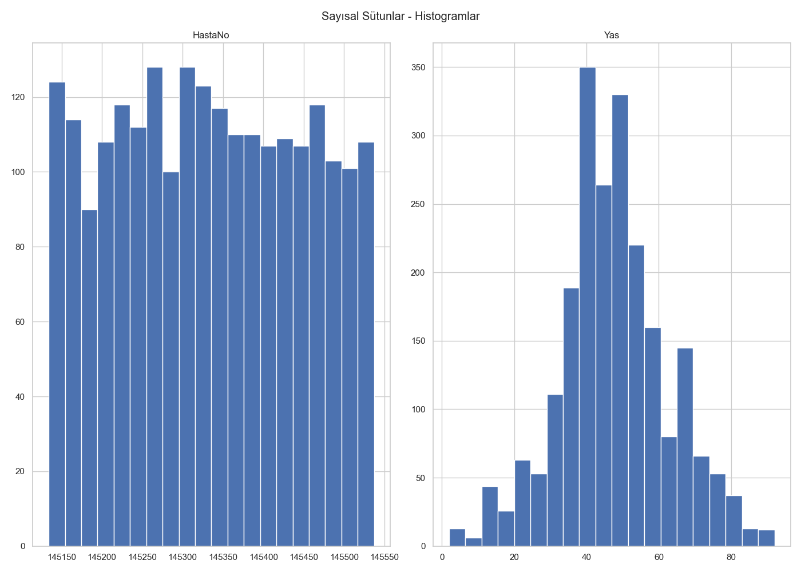
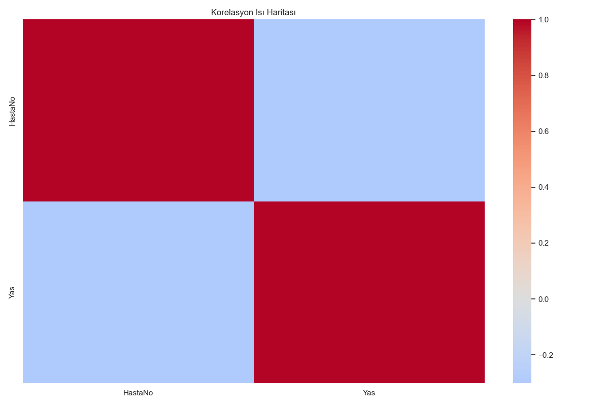
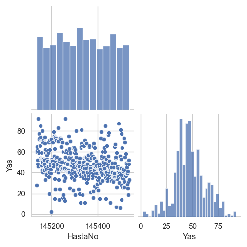
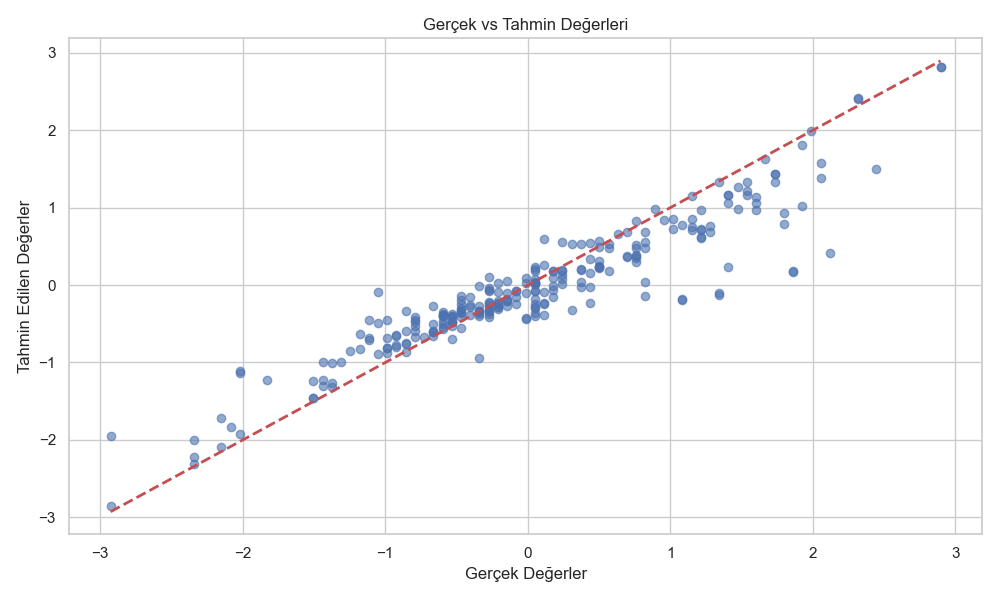
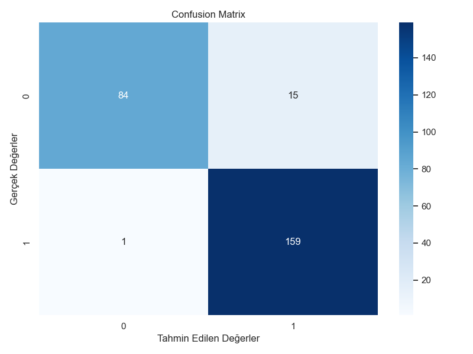

# 🏥 Sağlık Verisi Analiz Pipeline Projesi

Bu proje, sağlık verilerini analiz etmek için kapsamlı bir veri işleme ve modelleme pipeline'ı içermektedir. Proje, EDA (Exploratory Data Analysis), veri ön-işleme, özellik mühendisliği, ölçeklendirme ve modelleme adımlarını modüler bir `HealthDataPipeline` sınıfı ile sunar

## 📓 sample.ipynb – Detaylı İş Akışı ve Sonuçlar

### 1. Kütüphane Kurulumu ve Tema Ayarları
- Gerekli Python kütüphaneleri (`pandas`, `numpy`, `matplotlib`, `seaborn`) projeye dahil edilir.
- Seaborn teması ve grafik boyutları ayarlanır.
- Amaç: Tüm görsellerin okunaklı ve tutarlı olması.

---

### 2. Veri Yükleme ve İlk İnceleme
- `Talent_Academy_Case_DT_2025.xlsx` dosyası yüklenir.
- İlk 5 satır ve veri tipleri görüntülenir.
- Eksik değerler ve özet istatistikler (mean, std, min, max) incelenir.

Çıktıdan örnek:
```
Veri Setinin İlk 5 Satırı:
HastaNo | Yas | Cinsiyet | KanGrubu | ...
145134  | 60  | Kadın    | 0 Rh+    | ...
145135  | 28  | Erkek    | 0 Rh+    | ...
...
```
- Veri setinde toplam 2235 satır ve 13 sütun bulunur.

---

### 3. Eksik Veri Analizi
- Hangi sütunlarda eksik veri olduğu ve oranları analiz edilir.
- Eksik oranı yüksek olan sütunlar: `Alerji`, `KanGrubu`, `KronikHastalik`.
- Amaç: Eksik veri stratejisini belirlemek.

---

### 4. Veri Temizliği ve Gereksiz Sütunların Kaldırılması
- Modelleme için gereksiz olan sütunlar (`HastaNo`, `Tanilar`, `TedaviAdi`, `UygulamaYerleri`, `KronikHastalik`) veri setinden çıkartılır.
- Kalan veri setinin yapısı tekrar kontrol edilir.

---

### 5. Eksik Değerlerin Doldurulması
- Kategorik sütunlarda en sık görülen değer (mode), sayısal sütunlarda ise ortanca (median) ile doldurma yapılır.
- Gelişmiş doldurma için bazı sütunlarda KNNImputer kullanılır.

---

### 6. Özellik Mühendisliği
- Kategorik değişkenler one-hot encoding ile sayısallaştırılır.
- Özellikle `Cinsiyet`, `KanGrubu`, `Uyruk`, `Bolum` gibi sütunlar yeni sütunlara ayrılır.

---

### 7. Özellik Ölçeklendirme
- Tüm sayısal sütunlar `StandardScaler` ile normalize edilir.
- Amaç: Modelin farklı ölçeklerdeki verilerden etkilenmesini önlemek.

---

### 8. EDA (Keşifsel Veri Analizi) ve Görselleştirme
- Histogramlar: Sayısal sütunların dağılımı incelenir.
- Korelasyon Isı Haritası: Değişkenler arası ilişkiler görselleştirilir.
- Pairplot: Sayısal değişkenler arası dağılımlar ve ilişkiler.
- Çıktı dosyaları: outputs/ klasörüne kaydedilir.


### 9. Modelleme
- Hedef değişken olarak örneğin `Yas` veya `Cinsiyet` seçilir.
- Pipeline otomatik olarak regresyon veya sınıflandırma modelini seçer ve eğitir.
  - Sınıflandırma için: Random Forest Classifier
  - Regresyon için: Random Forest Regressor

Örnek Sonuçlar:
- Sınıflandırma (Cinsiyet hedefli):
  - Accuracy: 0.98
  - Macro avg F1: 0.97
  - Weighted avg F1: 0.98
- Regresyon (Yaş hedefli):
  - MSE, RMSE, MAE, R² gibi metrikler markdown raporda ve konsolda gösterilir.

- Model performans görselleri ve tüm EDA görselleri için aşağıdaki bölüme bakın: [📊 Üretilen Görselleştirmeler](#-üretilen-görselleştirmeler)

---

### 10. Pipeline ve Sonuçların Kaydedilmesi
- Eğitilmiş pipeline ve model `.joblib` dosyası olarak kaydedilir.
- EDA ve veri işleme adımlarının özeti markdown raporu olarak outputs/ klasörüne yazılır (ör. `eda_preprocessing_report_YYYYMMDD_HHMMSS.md`).

---

### 11. Son Kontrol ve Raporlama
- Son veri setinin yapısı, kalan eksik değerler ve model performansı tekrar incelenir.
- Tüm çıktılar ve analizler outputs/ klasöründe toplanır, böylece kullanıcı sonuçlara kolayca ulaşabilir.

---


## 📋 Proje İçeriği

- **`health_data_pipeline.py`**: Ana pipeline sınıfı (680 satır)
- **`pipeline_usage_example.py`**: Kullanım örnekleri ve demo script
- **`pipeline_example.ipynb`**: Jupyter notebook örneği
- **`Talent_Academy_Case_DT_2025.xlsx`**: Örnek sağlık veri seti
- **`requirements.txt`**: Gerekli Python kütüphaneleri
- **`outputs/`**: Üretilen görselleştirmeler ve raporlar

## 🚀 Kurulum

### 1. Gerekli Kütüphaneleri Yükleyin

```bash
pip install -r requirements.txt
```

### 2. Veri Dosyasının Konumunu Kontrol Edin

Veri dosyası (`Talent_Academy_Case_DT_2025.xlsx`) proje klasöründe bulunmalıdır.

## 🔧 Pipeline Özellikleri

### HealthDataPipeline Sınıfı

Bu sınıf, sağlık verilerini işlemek için aşağıdaki özellikleri sağlar:

#### 📊 Veri İşleme Adımları:
1. **Veri Yükleme**: Excel (.xlsx) ve CSV (.csv) dosyalarını destekler
2. **Veri Keşfi**: Veri yapısı, eksik veriler ve istatistiksel özetler
3. **Veri Temizliği**: Eksik veri doldurma ve duplicate temizleme
4. **Özellik Mühendisliği**: One-hot encoding ve kategorik dönüşümler
5. **Özellik Ölçeklendirme**: StandardScaler ile normalizasyon
6. **Modelleme Hazırlığı**: Hedef değişken ayrımı
7. **Model Eğitimi**: Random Forest (sınıflandırma/regresyon)

#### 💾 Pipeline Yönetimi:
- Pipeline durumunu kaydetme ve yükleme
- Pipeline adımlarını takip etme
- Pipeline özeti alma
- Otomatik rapor oluşturma

## 📖 Kullanım Örnekleri

### 🚀 Hızlı Başlangıç

Proje klasöründe aşağıdaki komutu çalıştırarak tüm pipeline'ı otomatik olarak başlatabilirsiniz:

```bash
python pipeline_usage_example.py
```

Bu komut ile:
- Veri yüklenir ve otomatik temizlenir
- EDA görselleri ve analiz raporları oluşturulur (outputs/ klasörüne kaydedilir)
- Özellik mühendisliği ve ölçeklendirme yapılır
- Hedef değişkene göre otomatik model eğitilir (sınıflandırma veya regresyon)
- Pipeline ve model dosyaları kaydedilir

---

### 🛠️ Adım Adım Kullanım (Gelişmiş)

Her adımı manuel olarak kontrol etmek için aşağıdaki kodu kullanabilirsiniz:

```python
from health_data_pipeline import HealthDataPipeline

pipeline = HealthDataPipeline()
pipeline.load_data('Talent_Academy_Case_DT_2025.xlsx')  # Veri yükle

# Veri keşfi (opsiyonel görseller için visualize_data çağırabilirsiniz)
pipeline.explore_data()

# Veri temizliği
pipeline.clean_data()

# Özellik mühendisliği
pipeline.feature_engineering()

# Özellik ölçeklendirme
pipeline.scale_features()

# Modelleme hazırlığı
X, y = pipeline.prepare_for_modeling(target_column='Yas')

# Model eğitimi
model, X_train, X_test, y_train, y_test = pipeline.train_model(X, y)

# (Opsiyonel) Pipeline'ı kaydet
pipeline.save_pipeline('health_pipeline.joblib')
```

Tüm görseller ve raporlar otomatik olarak `outputs/` klasörüne kaydedilir.

### 🎯 Cinsiyet hedefli sınıflandırma (Confusion Matrix)

```python
from health_data_pipeline import HealthDataPipeline

pipeline = HealthDataPipeline()
pipeline.load_data('Talent_Academy_Case_DT_2025.xlsx')
pipeline.clean_data()
pipeline.feature_engineering(preserve_columns=['Cinsiyet'])  # hedefi koru
pipeline.scale_features()

X, y = pipeline.prepare_for_modeling(target_column='Cinsiyet')
model, X_train, X_test, y_train, y_test = pipeline.train_model(
    X, y, model_type='classification'
)
```

- Çıktı (Confusion Matrix): `outputs/confusion_matrix_YYYYMMDD_HHMMSS.png`
- Not: Sklearn pipeline ile eğitimde dosya adı `confusion_matrix_sklearn_YYYYMMDD_HHMMSS.png` olur.
- Alternatif: `pipeline_usage_example.py` dosyasında `run_classification_example()` otomatik olarak bu adımları çalıştırır ve görseli üretir.

### 📈 Yaş hedefli regresyon (Gerçek vs Tahmin)

```python
from health_data_pipeline import HealthDataPipeline

pipeline = HealthDataPipeline()
pipeline.load_data('Talent_Academy_Case_DT_2025.xlsx')
pipeline.clean_data()
pipeline.feature_engineering()
pipeline.scale_features()

X, y = pipeline.prepare_for_modeling(target_column='Yas')
model, X_train, X_test, y_train, y_test = pipeline.train_model(
    X, y, model_type='regression'
)
```

- Çıktı (Gerçek vs Tahmin grafiği): `outputs/regression_actual_vs_pred_YYYYMMDD_HHMMSS.png`
- Alternatif: `pipeline_usage_example.py` dosyasında `main()` ve `run_full_pipeline_example()` regresyon akışını çalıştırır.

# Veri temizliği
```python
pipeline.clean_data()
```
# Özellik mühendisliği
```python
pipeline.feature_engineering()
```


# Özellik ölçeklendirme
```python
pipeline.scale_features()
```
# Modelleme hazırlığı
```python
X, y = pipeline.prepare_for_modeling(target_column='Yas')
```

# Model eğitimi
```python
model, X_train, X_test, y_train, y_test = pipeline.train_model(X, y)
```

### 3. Tek Seferde Tüm Pipeline

```python
# Tüm adımları tek seferde çalıştır
pipeline = HealthDataPipeline('Talent_Academy_Case_DT_2025.xlsx')
model, X_train, X_test, y_train, y_test = pipeline.run_full_pipeline(
    target_column='Yas',
    save_pipeline=True,
    pipeline_path='health_pipeline.joblib',
    include_eda=True
)
```

### 4. Sklearn Pipeline ile Eğitim

```python
# Ham veri üzerinden sklearn pipeline ile uçtan uca eğitim
X, y = pipeline.prepare_for_modeling(target_column='Cinsiyet')
clf, X_train, X_test, y_train, y_test = pipeline.train_with_sklearn_pipeline(
    X, y, model_type='classification'
)
```

### 5. Pipeline Kaydetme ve Yükleme

```python
# Pipeline'ı kaydet
pipeline.save_pipeline('health_pipeline.joblib')

# Yeni pipeline oluştur ve kaydedilmiş olanı yükle
new_pipeline = HealthDataPipeline()
new_pipeline.load_pipeline('health_pipeline.joblib')
```

## 📊 Üretilen Görselleştirmeler

Pipeline çalıştırıldığında `outputs/` klasörüne aşağıdaki görselleştirmeler kaydedilir:

### 1. Histogramlar


*Sayısal sütunların dağılımını gösteren histogramlar*
- **Özellikler**: KDE (Kernel Density Estimation) eğrileri dahil
- **Bin Ayarları**: Süre sütunları için tamsayı bin'ler, diğerleri için otomatik
- **Persentil Limitleri**: Aykırı değerleri gizlemek için 1-99 persentil aralığı

### 2. Korelasyon Isı Haritası


*Sayısal değişkenler arasındaki korelasyonları gösteren ısı haritası*
- **Renk Paleti**: Coolwarm (mavi-kırmızı) gradient
- **Merkez**: 0 değeri merkez alınarak pozitif/negatif korelasyonlar vurgulanır

### 3. Pairplot


*Sayısal değişkenler arasındaki ilişkileri gösteren pairplot*
- **Sınırlı Özellik**: Performans için ilk 5 sayısal sütun
- **Corner Format**: Üst üste binen grafikleri önler

### 5. Regresyon Analizi


*Gerçek vs tahmin edilen değerlerin karşılaştırılması*
- **Scatter Plot**: Gerçek vs tahmin değerleri
- **Referans Çizgi**: Mükemmel tahmin çizgisi (y=x)
- **Performans Metrikleri**: MSE, RMSE, MAE, R²

## 🎯 Desteklenen Veri Formatları

- **Excel (.xlsx)**: Pandas ile okuma
- **CSV (.csv)**: Pandas ile okuma

## 📊 Veri İşleme Özellikleri

### Eksik Veri Doldurma Stratejileri:
- **Kategorik sütunlar**: Mode (en sık tekrar eden değer)
- **Sayısal sütunlar**: Median (ortanca değer)
- **Sklearn Pipeline**: KNNImputer (k-nearest neighbors)

### Özellik Dönüşümleri:
- **One-Hot Encoding**: Kategorik sütunlar için
- **String Temizleme**: TedaviSuresi ve UygulamaSuresi sütunları (regex ile sayı çıkarma)
- **Ölçeklendirme**: StandardScaler ile normalizasyon
- **Label Encoding**: Hedef değişken için (gerekirse)
- **Veri Tipi Dönüşümleri**: Otomatik sayısal dönüşümler

### Otomatik Temizlik:
- Duplicate kayıtların kaldırılması
- Gereksiz sütunların kaldırılması (HastaNo, Tanilar, TedaviAdi, vb.)
- Veri tipi dönüşümleri

## 🔍 Modelleme Özellikleri

### Desteklenen Modeller:
- **Random Forest Classifier**: Kategorik hedef değişkenler için
- **Random Forest Regressor**: Sayısal hedef değişkenler için
- **Otomatik model seçimi**: Hedef değişken tipine göre otomatik belirleme
- **Otomatik veri bölme**: Train-test split (varsayılan: %80-%20)

### Model Performans Metrikleri:
- **Sınıflandırma**: Accuracy, Precision, Recall, F1-Score, Confusion Matrix
- **Regresyon**: MSE, RMSE, MAE, R² Score, Gerçek vs Tahmin grafiği

### Confusion Matrix (Sınıflandırma)



### Örnek Sonuçlar:
```
Sınıflandırma (Cinsiyet hedefli):
- Accuracy: 0.98
- Macro avg F1: 0.97
- Weighted avg F1: 0.98
```


## 🚀 Hızlı Başlangıç

### 1. Ortam Kurulumu
```bash
python -m pip install -r requirements.txt
```

### 2. Örnek Script'i Çalıştırın
```bash
python pipeline_usage_example.py
```

### 3. Jupyter Notebook'u Açın
```bash
jupyter notebook pipeline_example.ipynb
```

### 4. Manuel EDA ve Rapor
```bash
python -c "from health_data_pipeline import HealthDataPipeline; p=HealthDataPipeline('Talent_Academy_Case_DT_2025.xlsx'); p.load_data(); p.explore_data(); p.visualize_data(); p.clean_data(); p.feature_engineering(); p.scale_features(); print(p.generate_report())"
```

## 📝 Pipeline Adımları

Pipeline çalıştırıldığında aşağıdaki adımlar otomatik olarak gerçekleştirilir:

1. ✅ **Veri yükleme** - Excel/CSV dosyalarından veri okuma
2. ✅ **Veri keşfi** - Veri yapısı, eksik veriler ve istatistikler
3. ✅ **EDA görselleri** - Histogram, korelasyon ısı haritası ve pairplot
4. ✅ **Veri temizliği** - Eksik veri doldurma ve duplicate temizleme
5. ✅ **Özellik mühendisliği** - One-hot encoding ve kategorik dönüşümler
6. ✅ **Özellik ölçeklendirme** - StandardScaler ile normalizasyon
7. ✅ **Modelleme hazırlığı** - Hedef değişken ayrımı
8. ✅ **Model eğitimi** - Random Forest ile sınıflandırma/regresyon
9. ✅ **Pipeline kaydetme** - Joblib ile pipeline durumu kaydetme
10. ✅ **Rapor oluşturma** - EDA ve ön işleme raporu

## 🔧 Özelleştirme

### Hedef Değişken Seçimi:
```python
# Farklı hedef değişken ile pipeline çalıştır
X, y = pipeline.prepare_for_modeling(target_column='TedaviSuresi')
```

### Model Parametreleri:
```python
# Özel model parametreleri ile eğitim
model, X_train, X_test, y_train, y_test = pipeline.train_model(
    X, y, 
    test_size=0.3,      # Test seti oranı
    random_state=123,   # Rastgelelik seed'i
    model_type='auto'   # Otomatik model seçimi
)
```

### EDA Görselleştirmeleri:
```python
# Görselleştirmeleri kaydet
pipeline.visualize_data(max_pairplot_features=5)

# EDA raporu oluştur
report_path = pipeline.generate_report()
print(f"Rapor kaydedildi: {report_path}")
```

### Görselleştirme Ayarları:
```python
# Seaborn tema ayarları
sns.set_theme(style="whitegrid")
plt.rcParams['figure.figsize'] = [10, 6]

# Matplotlib backend (dosyaya kaydetme için)
matplotlib.use('Agg')
```


## 🆘 Sorun Giderme

### Yaygın Hatalar:

1. **Veri dosyası bulunamadı**: 
   - Dosya yolunu kontrol edin
   - `Talent_Academy_Case_DT_2025.xlsx` dosyasının proje klasöründe olduğundan emin olun

2. **Kütüphane hatası**: 
   ```bash
   pip install -r requirements.txt
   ```


### Debug Modu:
```python
# Detaylı çıktı için
import logging
logging.basicConfig(level=logging.DEBUG)
```

## 📋 Gereksinimler

- **Python**: 3.7+
- **Pandas**: 1.5.0+
- **NumPy**: 1.21.0+
- **Matplotlib**: 3.5.0+
- **Seaborn**: 0.11.0+
- **Scikit-learn**: 1.1.0+
- **OpenPyXL**: 3.0.0+ (Excel dosyaları için)
- **Joblib**: 1.1.0+ (Pipeline kaydetme için)
- **Tabulate**: 0.8.10+ (Rapor tabloları için)


## 🎯 Özellikler Özeti

- ✅ **Modüler Tasarım**: Her adım ayrı ayrı çalıştırılabilir
- ✅ **Otomatik Model Seçimi**: Hedef değişken tipine göre otomatik belirleme
- ✅ **Kapsamlı EDA**: Histogram, korelasyon, pairplot, boxplot görselleştirmeleri
- ✅ **Esnek Veri İşleme**: Excel ve CSV desteği
- ✅ **Pipeline Kaydetme**: Joblib ile durum kaydetme/yükleme
- ✅ **Otomatik Raporlama**: Markdown formatında detaylı raporlar
- ✅ **Sklearn Entegrasyonu**: ColumnTransformer ile modern pipeline
- ✅ **Hata Yönetimi**: Kapsamlı hata yakalama ve kullanıcı dostu mesajlar
- ✅ **Gelişmiş Görselleştirme**: KDE eğrileri, persentil limitleri, aykırı değer yönetimi
- ✅ **String İşleme**: Regex ile otomatik sayısal dönüşümler
- ✅ **Tek Çalıştırma**: Tüm pipeline adımları tek komutla çalıştırılabilir

---

